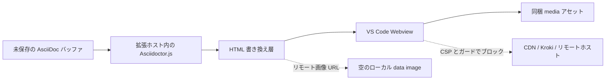

# AsciiDoc Zero-Network Preview

[](https://marketplace.visualstudio.com/items?itemName=YoshihideShirai.asciidoc-local-preview)
[](https://marketplace.visualstudio.com/items?itemName=YoshihideShirai.asciidoc-local-preview)
[](https://marketplace.visualstudio.com/items?itemName=YoshihideShirai.asciidoc-local-preview)

[English](README.md) | 日本語

Visual Studio Code で AsciiDoc をローカルプレビューするための拡張機能です。編集中の `.adoc` / `.ad` / `.asciidoc` / `.asc` ファイルを VS Code 内の Webview に表示し、MathJax、Mermaid、PlantUML、Kroki 互換の図表も外部サービスなしで確認できます。

次のような環境に向いています:

- 企業内のドキュメント環境
- インターネット接続を制限したネットワーク
- セキュリティ要件の高い文書作成
- 外部サービスの利用を禁止している組織


## Highlights

- 編集中の未保存バッファをそのままプレビューに反映します。
- Asciidoctor.js による AsciiDoc プレビューを VS Code 内で実行します。
- MathJax による `stem` / `latexmath` の数式表示に対応しています。
- プレビューの見た目と同梱 CSS は [`antora/antora-ui-default`](https://gitlab.com/antora/antora-ui-default) をベースにしています。
- 図、表、式のキャプションを章番号付きで採番します。
- `emoji:name[]` 形式の絵文字インラインマクロをローカルの Unicode 文字として表示します。
- Kroki 互換の図表構文を `asciidoctor-kroki-embedded` で変換し、Mermaid、PlantUML、Nomnoml、Vega、Vega-Lite、WaveDrom、Bytefield の図表を同梱ローカルアセットで描画します。
- 太字、斜体、等幅、リンク、見出し、箇条書きなど、よく使う AsciiDoc 編集コマンドを追加します。
- AsciiDoc の言語サポート、文法、スニペット、ファイルアイコンは `asciidoctor/asciidoctor-vscode` に任せることで共存しやすくしています。
- 画像ホストを明示的に許可しない限り、CDN、Kroki サーバー、外部画像読み込みに依存しないプレビュー経路を重視しています。


## 差別化ポイント

AsciiDoc Zero-Network Preview は、`asciidoctor/asciidoctor-vscode` よりも「ローカルで安全にプレビューすること」に絞った拡張です。

| 観点 | AsciiDoc Zero-Network Preview | `asciidoctor/asciidoctor-vscode` |
| --- | --- | --- |
| 目的 | ローカルプレビュー特化 | AsciiDoc 総合支援 |
| 図表 | 主要図表を同梱アセットで描画 | Kroki 連携で幅広く対応 |
| 外部送信 | 既定で送らない設計 | Kroki 利用時は送信あり |
| PlantUML | Java / Graphviz 不要 | Kroki 連携で描画 |
| 数式・絵文字 | MathJax / emoji を同梱対応 | 拡張で追加可能 |
| 出力 | なし | PDF / HTML / DocBook |
| 向く用途 | 機密文書・オフライン確認 | 変換や出力まで行う制作環境 |

AsciiDoc Zero-Network Preview は独自の `asciidoc` 言語定義や TextMate grammar を登録しません。シンタックスハイライト、スニペット、ファイル関連付け、PDF 出力などの制作支援が必要な場合は、`asciidoctor/asciidoctor-vscode` と併用してください。

## 組み込み Asciidoctor.js 拡張

プレビューでは、各ドキュメントの変換前に次の Asciidoctor.js 拡張を登録します。

| 拡張 | パッケージ / 配布元 | 構文 / 対象 | 役割 |
| --- | --- | --- | --- |
| Kroki embedded 図表プロセッサ | [`asciidoctor-kroki-embedded`](https://github.com/YoshihideShirai/asciidoctor-kroki-embedded) | `[mermaid]`、`[plantuml]`、`[nomnoml]`、`[vega]`、`[vegalite]`、`[wavedrom]`、`[bytefield]` と、`mermaid::path[]` などの対応するブロックマクロ | 対応する Kroki 互換ブロックとローカルファイルマクロを非実行の Webview 描画対象へ変換します。 |
| source 言語図表フォールバック | この拡張に内蔵 | `[source,mermaid]`、`[source,nomnoml]` などの source listing ブロック | 対応する図表言語のハイライト済み source listing を同じローカル描画対象へ書き換えます。 |
| 絵文字インラインマクロプロセッサ | [`asciidoctor-emoji`](https://github.com/mogztter/asciidoctor-emoji) 互換 | `emoji:name[]` | 互換インラインマクロをローカル Unicode 絵文字として表示します。 |
| 番号付きキャプションツリープロセッサ | [`asciidoctor-numbered-captions`](https://github.com/YoshihideShirai/asciidoctor-numbered-captions) | image、table、stem ブロック | 章番号付きキャプション採番を適用します。 |

## Getting Started

1. VS Code で AsciiDoc ファイルを開きます。
2. コマンドパレットから **AsciiDoc: Open Zero-Network Preview** を実行します。
3. エディタータイトルまたはコンテキストメニューからもプレビューを開けます。

プレビューは編集中の内容に追従します。必要な場合は **AsciiDoc: Refresh Preview** で Webview を再描画できます。

## プレビュー幅

ドキュメントのプレビューは、既定では同梱の Antora 風の読みやすい幅に制限されます。ドキュメント領域を VS Code Webview のウィンドウ幅まで広げるには、`asciidoc-local-preview.previewWidth` を `window` に設定します。

```json
{
  "asciidoc-local-preview.previewWidth": "window"
}
```

`default` に戻すと、幅を制限した既定の表示に戻ります。

## Antora プロジェクトのプレビュー

開いているドキュメントが Antora component ディレクトリ内にある場合、Antora サイトジェネレーターやリモートサービスへ接続せずに、同じ component 内の Antora module resource を解決できます。拡張機能は `antora.yml` と `modules/` を持つディレクトリを component root として検出します。

プレビューで対応する参照例:

- `include::partial$name.adoc[]`
- `include::example$name.adoc[]`
- `include::page$name.adoc[]`
- `include::shared:page$name.adoc[]` のような module-qualified resource
- `include::../partials/name.adoc[]` のように現在の Antora module 内に収まる相対 include
- `assets/images` から解決する `image::image$name.svg[]` のような画像 resource

リポジトリには、partials、examples、相対 include、別 module、Antora 画像 resource を確認できる最小サンプルとして `examples/antora-preview/modules/ROOT/pages/index.adoc` を同梱しています。

## リモート画像ホスト

リモート画像は既定でブロックされます。プレビューで特定のホストだけ許可する場合は、VS Code 設定で `asciidoc-local-preview.allowedPreviewHosts` を指定します。

```json
{
  "asciidoc-local-preview.allowedPreviewHosts": [
    "example.com",
    "https://images.example.org"
  ]
}
```

ホスト名だけの指定は、その完全一致ホストの `https` と `http` 画像を許可します。スキーム付きの指定は、そのスキームだけを許可します。パス、ワイルドカード、認証情報、クエリ、フラグメントを含む設定値は無効として無視されます。

## Supported Diagrams

Kroki 互換のブロック記法で、次の図表をローカルに描画できます。Asciidoctor 変換時には非実行の埋め込み図表ターゲットを生成し、Webview 側で対応済みの図表だけを同梱レンダラで描画します。

```asciidoc
[mermaid]
----
graph TD
  A[AsciiDoc] --> B[Local Preview]
----

[plantuml]
....
Alice -> Bob : Hello
....

[nomnoml]
----
[User] -> [VS Code]
----
```

対応している図表:

- Mermaid
- PlantUML
- Nomnoml
- Vega
- Vega-Lite
- WaveDrom
- Bytefield

`mermaid::diagrams/system.mmd[]` や `plantuml::diagrams/sequence.puml[]` のようなローカルファイルマクロも利用できます。マクロの参照先は、ドキュメントと同じディレクトリ配下の相対パスに制限されます。リモート URL、絶対パス、ドキュメントディレクトリ外へ抜けるパスは描画前に拒否されます。

## Math and Emoji

AsciiDoc の `stem` ブロックや `latexmath` インライン記法を MathJax で表示します。

```asciidoc
latexmath:[E = mc^2]

[stem]
++++
\frac{1}{2}
++++
```

絵文字は `asciidoctor-emoji` 互換のインラインマクロで書けます。

```asciidoc
I emoji:heart[1x] Asciidoctor.js emoji:tada[2x]
```

`1x`、`lg`、`2x`、`3x`、`4x`、`5x`、`42px` のようなサイズ指定に対応しています。絵文字は CDN から SVG を読み込まず、ローカルで Unicode 文字として表示します。

## Numbered Captions

図、表、式のキャプションは `asciidoctor-numbered-captions` により、`Figure 1-1`、`Table 2-3`、`Equation 4-2` のように章番号を含めて採番されます。

文書ごとに Asciidoctor 標準のキャプション採番へ戻したい場合は、ヘッダー属性を追加してください。

```asciidoc
:numbered-captions-numbering: standard
```

## Local Preview Boundary

AsciiDoc Zero-Network Preview は、ドキュメント内容を CDN、Kroki サーバー、リモート画像ホスト、その他の外部サービスへ送らずにプレビューできるよう設計しています。単に「セキュアです」と主張するのではなく、複数の層で境界を作っています。



プレビュー経路では、次の制御を行います。

- Asciidoctor.js は拡張ホスト内で `safe: 'safe'` として実行されます。
- 変換時に `allow-uri-read` は明示的に無効化されています。
- Kroki 互換の図表ブロックとローカルファイルマクロは `asciidoctor-kroki-embedded` で処理され、Kroki サーバーへ接続せずに埋め込み HTML ターゲットを生成します。
- リモート画像 URL は、完全一致ホストが `asciidoc-local-preview.allowedPreviewHosts` に含まれる場合を除き、プレビュー前に空のローカル data image に置き換えられます。
- Webview の `localResourceRoots` は拡張ディレクトリ、workspace folders、現在のドキュメントディレクトリに限定されます。
- CSS、MathJax、Mermaid、PlantUML、Nomnoml、Vega、Vega-Lite、WaveDrom、Bytefield は同梱された `media` 配下のファイルから読み込まれます。
- PlantUML の描画に Java、Graphviz、Kroki サーバーは不要です。

### ネットワークアクセス監査

公開前や生成コードを取り込む前には、ネットワーク利用を検査する監査スクリプトを実行できます。

```sh
npm run verify:no-network
```

このスクリプトは、拡張が管理するコードに次のような回帰パターンが入ると失敗します。

- `fetch`、`XMLHttpRequest`、`WebSocket`、`EventSource` などのブラウザー向けネットワーク API。
- `http`、`https`、`net`、`tls`、`dns` などの Node.js ネットワークモジュール import。
- `child_process`、`spawn`、`exec` などのプロセス実行 API。
- 実行時コード内のリモート URL リテラル。
- リモートの `http`、`https`、`wss`、ワイルドカードソースを許可する CSP ディレクティブ。
- Asciidoctor 変換での `allow-uri-read: true` または `safe: 'unsafe'`。
- ローカルプレビューの許可リスト外の runtime dependency。

監査では、同梱プレビューライブラリが `fetch`、`XMLHttpRequest`、`WebSocket`、`EventSource`、`navigator.sendBeacon` の Webview ガードで保護されていることも確認します。このチェックは `npm test` の前にも自動実行されます。

### CSP 設計方針

Webview は `default-src 'none'` から開始し、ローカル描画に必要なソースだけを個別に許可します。

| ディレクティブ | ポリシー | 意図 |
| --- | --- | --- |
| `default-src` | `'none'` | 他のディレクティブで許可しない限り、すべての読み込みを拒否します。 |
| `img-src` | Webview ローカルソース、`data:`、許可済みリモート画像ホスト | 書き換え後のローカル画像、空のプレースホルダー画像、明示的に許可したリモート画像を許可します。 |
| `font-src` | Webview ローカルソース | 同梱 MathJax フォントだけを読み込みます。 |
| `style-src` | Webview ローカルソースとインラインスタイル | 同梱プレビュー CSS とドキュメントスコープのスタイルを許可します。 |
| `script-src` | Webview ローカルソース、nonce、WASM eval | 同梱レンダラースクリプトと nonce 付き初期化コードだけを実行します。 |
| `connect-src` | 未設定 | `default-src 'none'` によりネットワーク接続を拒否したままにします。 |

## Commands

- **AsciiDoc: Open Zero-Network Preview**
- **AsciiDoc: Refresh Preview**
- **AsciiDoc: Bold**
- **AsciiDoc: Italic**
- **AsciiDoc: Monospace**
- **AsciiDoc: Insert Link**
- **AsciiDoc: Insert Section Heading**
- **AsciiDoc: Insert Unordered List**

## Development

```sh
npm install
npm run compile
npm run lint
npm run verify:no-network
npm test
```

## Bundled Licenses

The bundled preview stylesheet is adapted from [`antora/antora-ui-default`](https://gitlab.com/antora/antora-ui-default) and keeps its MPL-2.0 license notice in `media/antora-default-preview.css`.

Bundled MathJax assets keep Apache-2.0 license copies in `media/mathjax/LICENSE` and `media/mathjax-newcm/LICENSE`.

The emoji name map is generated from `asciidoctor-emoji` and keeps its MIT license copy in `licenses/asciidoctor-emoji-LICENSE`.

The AsciiDoc file and extension icons are adapted from the `vscode-icons` project and keep its MIT license copy in `licenses/vscode-icons-LICENSE`.
