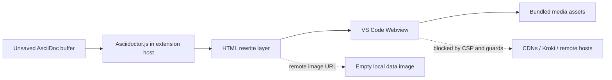

# AsciiDoc Zero-Network Preview

[](https://marketplace.visualstudio.com/items?itemName=YoshihideShirai.asciidoc-local-preview)
[](https://marketplace.visualstudio.com/items?itemName=YoshihideShirai.asciidoc-local-preview)
[](https://marketplace.visualstudio.com/items?itemName=YoshihideShirai.asciidoc-local-preview)

English | [日本語](README.ja.md)

AsciiDoc Zero-Network Preview is a Visual Studio Code extension for previewing AsciiDoc files locally. It renders the active `.adoc`, `.ad`, `.asciidoc`, or `.asc` editor buffer in a VS Code Webview, with MathJax, Mermaid, PlantUML, and Kroki-compatible diagrams available without external services.

Ideal for:

- Corporate environments
- Air-gapped networks
- Security-sensitive documentation
- Organizations that prohibit external services


## Highlights

- Updates the preview from the unsaved editor buffer.
- Renders AsciiDoc inside VS Code with Asciidoctor.js.
- Supports MathJax for AsciiDoc `stem` blocks and `latexmath` expressions.
- Uses the [`antora/antora-ui-default`](https://gitlab.com/antora/antora-ui-default) look and bundled CSS as the basis for the preview appearance.
- Numbers figure, table, and equation captions with chapter-aware prefixes.
- Renders `emoji:name[]` inline macros as local Unicode emoji.
- Converts Kroki-compatible diagram syntax with `asciidoctor-kroki-embedded`, then draws Mermaid, PlantUML, Nomnoml, Vega, Vega-Lite, WaveDrom, and Bytefield diagrams from bundled local assets.
- Adds common AsciiDoc editing commands for bold, italic, monospace, links, headings, and unordered lists.
- Coexists with `asciidoctor/asciidoctor-vscode` by leaving AsciiDoc language support, grammar, snippets, and file icons to that extension.
- Keeps the preview path independent of CDNs, Kroki servers, and remote image loading unless image hosts are explicitly allowlisted.


## Differentiators

AsciiDoc Zero-Network Preview is narrower than `asciidoctor/asciidoctor-vscode`: it focuses on safe local preview.

| Area | AsciiDoc Zero-Network Preview | `asciidoctor/asciidoctor-vscode` |
| --- | --- | --- |
| Focus | Local preview | Full AsciiDoc authoring |
| Diagrams | Bundled local renderers | Broad Kroki support |
| External send | Avoided by default | Used with Kroki |
| PlantUML | No Java / Graphviz | Via Kroki |
| Math / emoji | Bundled MathJax / emoji | Extensions available |
| Export | None | PDF / HTML / DocBook |
| Best for | Confidential or offline checks | Conversion and publishing |

AsciiDoc Zero-Network Preview does not contribute its own `asciidoc` language definition or TextMate grammar. If you want syntax highlighting, snippets, file associations, PDF export, or broader authoring support, install `asciidoctor/asciidoctor-vscode` alongside this extension.

## Built-in Asciidoctor.js Extensions

The preview registers these Asciidoctor.js extensions before converting each document:

| Extension | Package / source | Syntax / target | Purpose |
| --- | --- | --- | --- |
| Kroki embedded diagram processors | [`asciidoctor-kroki-embedded`](https://github.com/YoshihideShirai/asciidoctor-kroki-embedded) | `[mermaid]`, `[plantuml]`, `[nomnoml]`, `[vega]`, `[vegalite]`, `[wavedrom]`, `[bytefield]`, plus matching block macros such as `mermaid::path[]` | Converts supported Kroki-compatible blocks and local file macros into inert Webview render targets. |
| Source-language diagram fallback | Built in | `[source,mermaid]`, `[source,nomnoml]`, and matching source listing blocks | Rewrites highlighted source listings for supported diagram languages into the same local render targets. |
| Emoji inline macro processor | [`asciidoctor-emoji`](https://github.com/mogztter/asciidoctor-emoji) compatible | `emoji:name[]` | Renders compatible inline macros as local Unicode emoji. |
| Numbered captions tree processor | [`asciidoctor-numbered-captions`](https://github.com/YoshihideShirai/asciidoctor-numbered-captions) | image, table, and stem blocks | Applies chapter-aware caption numbering. |

## Getting Started

1. Open an AsciiDoc file in VS Code.
2. Select the editor tab for the `.adoc`, `.ad`, `.asciidoc`, or `.asc` file you want to preview.
3. Click the preview icon in the editor title bar, or run **AsciiDoc: Open Zero-Network Preview** from the Command Palette.
4. You can also open the preview from the editor context menu.

The preview follows changes in the active editor. If the Webview needs to be redrawn manually, run **AsciiDoc: Refresh Preview**.

## Preview Width

The document preview uses the bundled Antora-style reading width by default. To expand the document area to the full VS Code Webview width, set `asciidoc-local-preview.previewWidth` to `window`:

```json
{
  "asciidoc-local-preview.previewWidth": "window"
}
```

Set it back to `default` to restore the constrained reading width.

## Antora Project Preview

When the active document is inside an Antora component directory, the preview can resolve Antora module resources without contacting an Antora site generator or remote service. The extension detects a component root by looking for `antora.yml` and `modules/`, then resolves resources in the current component.

Supported preview references include:

- `include::partial$name.adoc[]`
- `include::example$name.adoc[]`
- `include::page$name.adoc[]`
- module-qualified resources such as `include::shared:page$name.adoc[]`
- relative includes that stay inside the current Antora module, such as `include::../partials/name.adoc[]`
- image resources such as `image::image$name.svg[]`, resolved from `assets/images`

The repository includes a minimal sample at `examples/antora-preview/modules/ROOT/pages/index.adoc` that exercises partials, examples, relative includes, a second module, and an Antora image resource.

## Remote Image Hosts

Remote images are blocked by default. To allow specific hosts in the preview, set `asciidoc-local-preview.allowedPreviewHosts` in VS Code settings:

```json
{
  "asciidoc-local-preview.allowedPreviewHosts": [
    "example.com",
    "https://images.example.org"
  ]
}
```

Host-only entries allow both `https` and `http` images for that exact host. Scheme-qualified entries allow only that scheme. Paths, wildcards, credentials, queries, and fragments are ignored as invalid setting entries.

## Supported Diagrams

Use Kroki-compatible block syntax to render diagrams locally. The Asciidoctor conversion step emits inert embedded diagram targets, and the Webview hydrates only the supported types with bundled renderers.

```asciidoc
[mermaid]
----
graph TD
  A[AsciiDoc] --> B[Local Preview]
----

[plantuml]
....
Alice -> Bob : Hello
....

[nomnoml]
----
[User] -> [VS Code]
----
```

Supported diagram types:

- Mermaid
- PlantUML
- Nomnoml
- Vega
- Vega-Lite
- WaveDrom
- Bytefield

Local file macros such as `mermaid::diagrams/system.mmd[]` and `plantuml::diagrams/sequence.puml[]` are supported too. Macro targets must be relative paths inside the document directory. Remote URLs, absolute paths, and paths that escape the document directory are rejected before rendering.

## Math and Emoji

Render AsciiDoc `stem` blocks and `latexmath` inline expressions with MathJax.

```asciidoc
latexmath:[E = mc^2]

[stem]
++++
\frac{1}{2}
++++
```

Use `asciidoctor-emoji` compatible inline macros for emoji.

```asciidoc
I emoji:heart[1x] Asciidoctor.js emoji:tada[2x]
```

Supported emoji sizes include `1x`, `lg`, `2x`, `3x`, `4x`, `5x`, and explicit pixel sizes such as `42px`. Emoji are rendered as local Unicode text instead of loading SVGs from a CDN.

## Numbered Captions

Figure, table, and equation captions use `asciidoctor-numbered-captions` so numbering includes the current chapter, such as `Figure 1-1`, `Table 2-3`, or `Equation 4-2`.

To use Asciidoctor's standard caption numbering for a document, add this header attribute:

```asciidoc
:numbered-captions-numbering: standard
```

## Local Preview Boundary

AsciiDoc Zero-Network Preview is designed so local preview does not send document contents to CDNs, Kroki servers, remote image hosts, or other external services. The boundary is enforced in several layers instead of relying on a single "secure by intent" claim.



The preview path uses these controls:

- Asciidoctor.js runs in the extension host with `safe: 'safe'`.
- `allow-uri-read` is explicitly disabled during conversion.
- Kroki-compatible diagram blocks and local file macros are handled by `asciidoctor-kroki-embedded`, which emits embedded HTML targets without contacting a Kroki server.
- Remote image URLs are replaced with an empty local data image before rendering unless their exact host is listed in `asciidoc-local-preview.allowedPreviewHosts`.
- Webview `localResourceRoots` are limited to the extension directory, workspace folders, and the current document directory.
- CSS, MathJax, Mermaid, PlantUML, Nomnoml, Vega, Vega-Lite, WaveDrom, and Bytefield load from bundled files under `media`.
- PlantUML rendering does not require Java, Graphviz, or a Kroki server.

### No-network verification

Before publishing or accepting generated changes, run the no-network audit:

```sh
npm run verify:no-network
```

The script fails on common regression patterns in extension-controlled code:

- Browser network APIs such as `fetch`, `XMLHttpRequest`, `WebSocket`, and `EventSource`.
- Node network module imports such as `http`, `https`, `net`, `tls`, `dns`, and related modules.
- Process execution APIs such as `child_process`, `spawn`, and `exec`.
- Remote URL literals in runtime code.
- CSP directives that allow remote `http`, `https`, `wss`, or wildcard sources.
- `allow-uri-read: true` or `safe: 'unsafe'` in Asciidoctor conversion.
- Runtime dependencies outside the local-preview allowlist.

The audit also checks that vendored preview libraries are protected by Webview guards for `fetch`, `XMLHttpRequest`, `WebSocket`, `EventSource`, and `navigator.sendBeacon`. This check runs automatically before `npm test`.

### CSP design

The Webview starts from `default-src 'none'` and then opens only the sources required for local rendering.

| Directive | Policy | Reason |
| --- | --- | --- |
| `default-src` | `'none'` | Deny all loading unless another directive allows it. |
| `img-src` | Webview local source, `data:`, plus allowlisted remote image hosts | Allow rewritten local images, the empty placeholder image, and explicitly allowed remote images. |
| `font-src` | Webview local source | Load bundled MathJax fonts only. |
| `style-src` | Webview local source plus inline styles | Load bundled preview CSS and document-scoped styles. |
| `script-src` | Webview local source plus a nonce and WASM eval | Run only bundled renderer scripts and nonce-marked bootstrapping code. |
| `connect-src` | Not set | Keep network connections denied by `default-src 'none'`. |

## Commands

- **AsciiDoc: Open Zero-Network Preview**
- **AsciiDoc: Refresh Preview**
- **AsciiDoc: Bold**
- **AsciiDoc: Italic**
- **AsciiDoc: Monospace**
- **AsciiDoc: Insert Link**
- **AsciiDoc: Insert Section Heading**
- **AsciiDoc: Insert Unordered List**

## Development

```sh
npm install
npm run compile
npm run lint
npm run verify:no-network
npm test
```

## Bundled Licenses

The bundled preview stylesheet is adapted from [`antora/antora-ui-default`](https://gitlab.com/antora/antora-ui-default) and keeps its MPL-2.0 license notice in `media/antora-default-preview.css`.

Bundled MathJax assets keep Apache-2.0 license copies in `media/mathjax/LICENSE` and `media/mathjax-newcm/LICENSE`.

The emoji name map is generated from `asciidoctor-emoji` and keeps its MIT license copy in `licenses/asciidoctor-emoji-LICENSE`.

The AsciiDoc file and extension icons are adapted from the `vscode-icons` project and keep its MIT license copy in `licenses/vscode-icons-LICENSE`.
